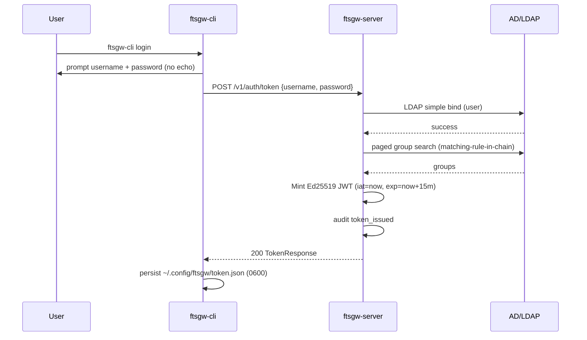
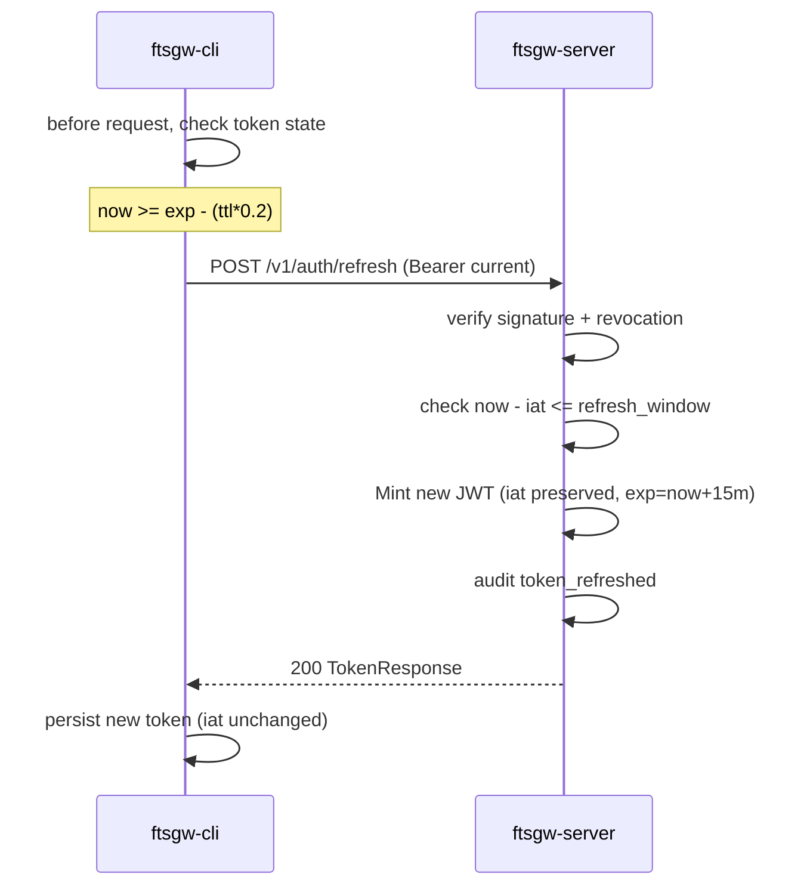
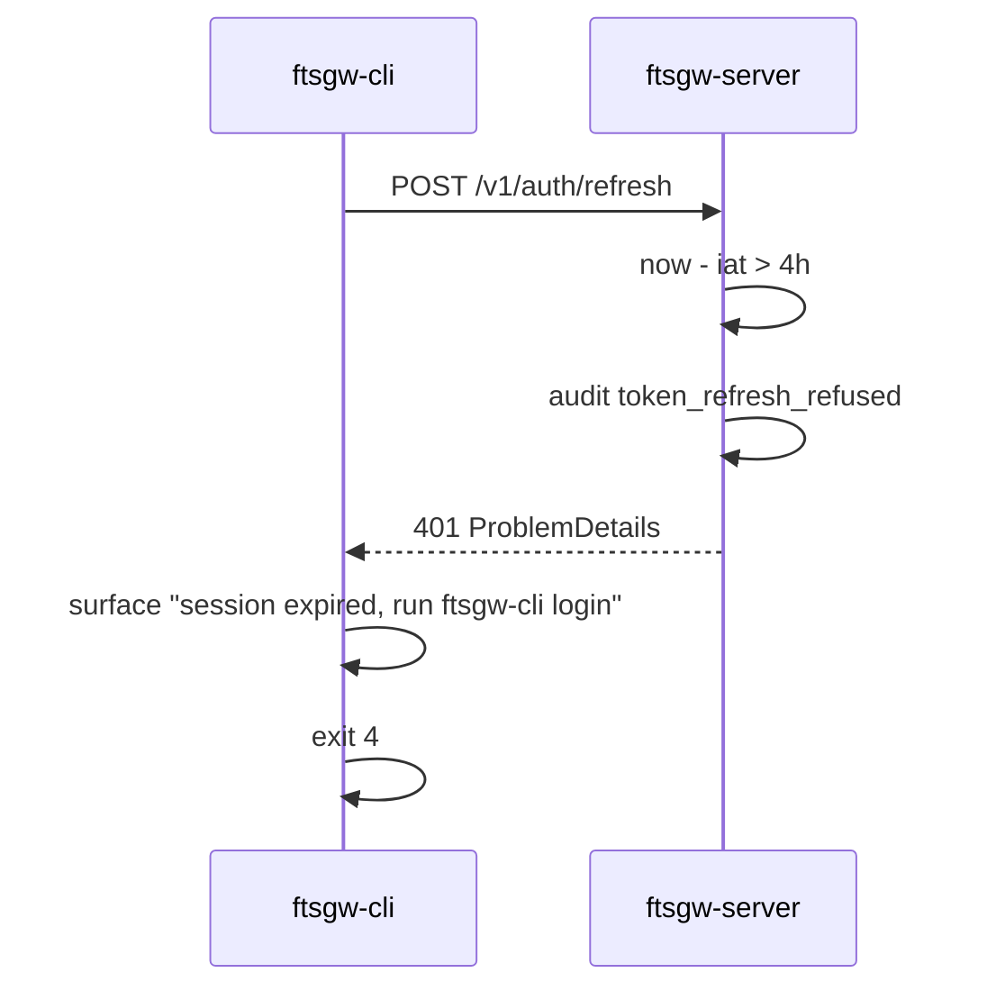
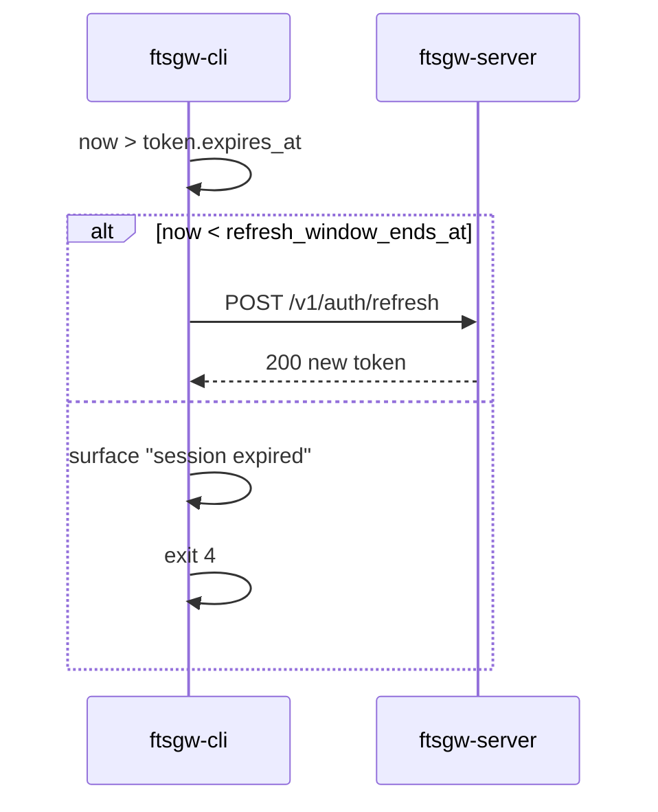
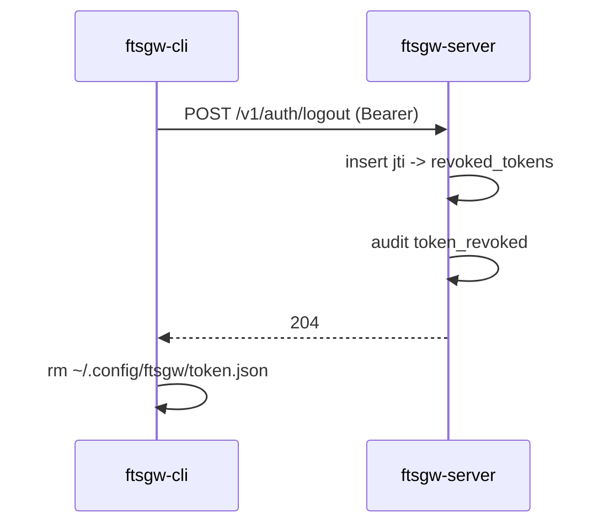

# ftsgw Authentication Flow

This document covers the complete password-auth lifecycle in Phase 0 (Mode 3, fully disconnected).

## First login

## Auto refresh (80% of TTL elapsed)

## Refresh window exhausted

## Idle expiry (token expired before next command)

## Logout

